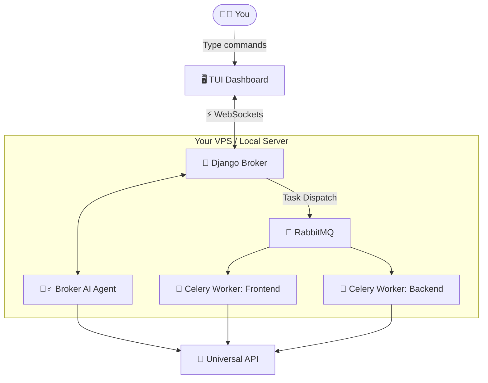

# 🌌 Omnigent 🚀
```text
  ____                  _                  _   
 / __ \                (_)                | |  
| |  | | _ __ ___   _ __  _   __ _   ___  __ | |_ 
| |  | || '_ ` _ \ | '_ \| | / _` | / _ \ '_ \| __|
| |__| || | | | | || | | | || (_| ||  __/ | | | |_ 
 \____/ |_| |_| |_||_| |_|_| \__, | \___|_| |_|\__|
                              __/ |                
                             |___/                 
```
**The ultimate command center for your AI worker fleet.**

[](https://www.python.org)
[](https://www.djangoproject.com)
[](https://docs.celeryq.dev/)
[](https://textual.textualize.io/)

---

## 🤔 Why Omnigent?

Are you tired of juggling 15 different browser tabs just to chat with your AI coding assistants? Do you lose track of context, forget which prompt you pasted where, and feel the chaos taking over? 🌪️

**Welcome to Omnigent.** (Formerly known as Agent Top).

Omnigent gives you a calm, inspectable, `htop`-style terminal dashboard to monitor, steer, and manage multiple AI sessions simultaneously. You don't just chat anymore; you **command a fleet**. 🧑‍✈️

---

## ✨ Features

- **🤖 Intelligent Broker:** Type natural language into the TUI, and the Broker Agent automatically spins up specialized sub-agents to do the heavy lifting!
- **📦 Any LLM You Want:** Powered by LiteLLM, you can use Gemini, OpenAI, Anthropic, or even your own Local LLaMA!
- **📜 Event-Driven History:** Every task, message, and artifact is logged to an append-only PostgreSQL database.
- **💻 Calm TUI:** A beautiful, non-flashing terminal UI built with Textual.

## 🏗️ How It Works



---

## 🚀 Quick Start (VPS Deployment)

Omnigent uses a production-grade backend (Django, PostgreSQL, RabbitMQ, Redis). The best way to run it is on a dedicated Linux VPS or a robust local dev machine with Docker! 🐳

1. **Clone the repository:**
   ```bash
   git clone https://github.com/yourusername/omnigent.git
   cd omnigent
   ```

2. **Run the magic setup script! 🪄**
   ```bash
   bash setup.sh
   ```

3. **Configure your API Keys 🗝️:**
   Open the newly generated `.env` file and plug in your favorite LLM key:
   ```env
   # Use whichever you like!
   GEMINI_API_KEY=your_key_here
   OPENAI_API_KEY=your_key_here
   DEFAULT_LLM_MODEL=gemini/gemini-1.5-pro
   ```

4. **Launch the TUI Dashboard 🎛️:**
   ```bash
   source venv/bin/activate
   python -m cli.main top
   ```

Now, just type `"Analyze the authentication system and create a test plan"` into the bottom bar and watch the Broker spawn an agent to do it for you!

---

## 📚 Documentation
For a deeper dive into the philosophy and technical design, check out:
- [📖 Vision & Philosophy](docs/vision.md)
- [🏗️ Architectural Design](docs/architecture.md)

---

## 🔮 Future Roadmap
- 🐳 **Containerized Agents:** One agent = one isolated Docker container.
- 🎙️ **Voice Integration:** Control your fleet via smartphone SSH and voice-to-text.
- 💾 **Context Packs:** Easily share specific repo folders with specific agents.

*Built with ❤️ for developers who want less chaos and more code.*
